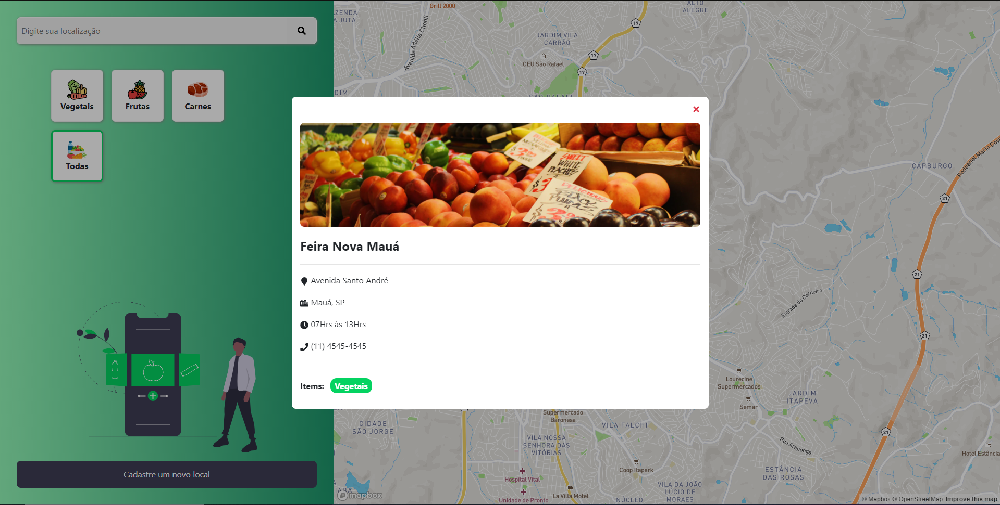
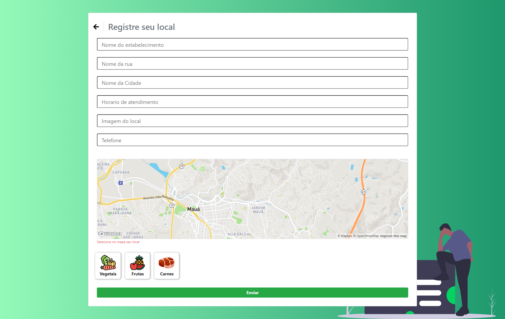

# Hackaton

**HEALFFY** _- Mapa de Feirinhas e Sacolões_    <https://healffy.netlify.app/>

Projeto Hackaton Saúde Infantil - Evento organizado pela Shawee e o Instituto Desiderata. 

Nesse aplicativo web visamos facilitar o acesso a informação da localização de feirinhas e sacolões para qualquer pessoa de forma gratuita.
Também é possível que qualquer pessoa registre a localização de alguma feirinha ou mercadinho que ainda não esteja em nosso banco de dados sem necessidade de criar conta.
Esperamos que com isso as pessoas sejam estimuladas a comer alimentos mais saudáveis, e ainda que comerciantes de alimentos orgânicos recebam mais clientes.

